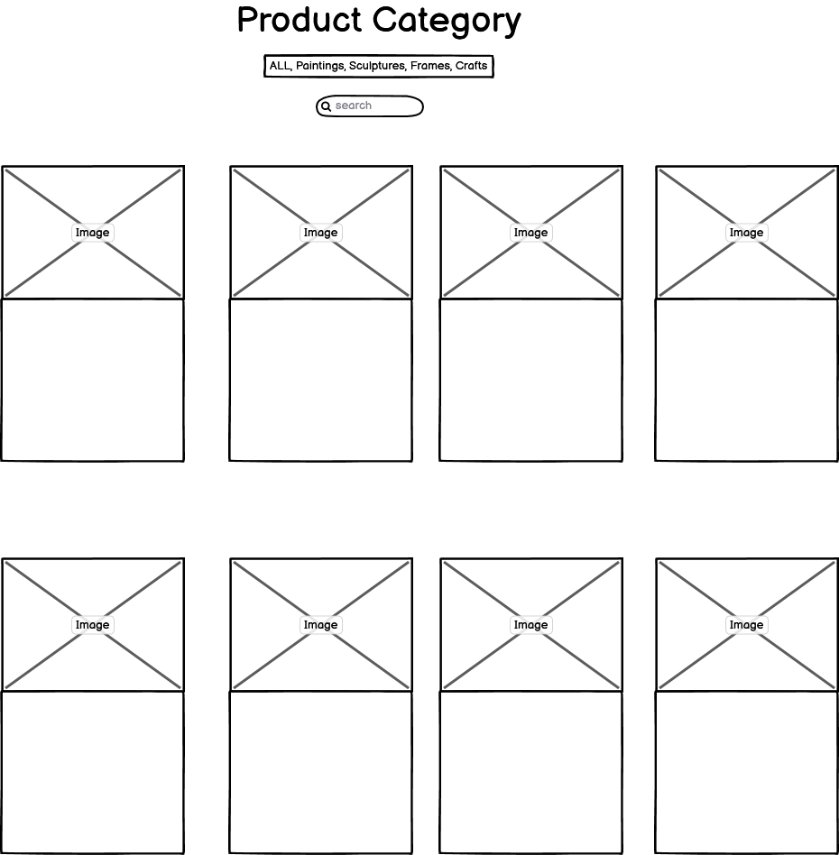

# WELCOME TO ZAWADI E-COMMERCE STORE. YOUR ONE-STOP ONLINE SHOP FOR PURCHASING BEAUTIFUL AFRICAN ART PIECES

# 1. Motivation:

This project aims to create an online e-commerce store that celebrates and showcases African art pieces. Our motivation is to provide art enthusiasts, collectors, and anyone interested in African culture with a platform to explore, appreciate, and purchase unique and authentic African artworks.

# 2. User Experience:

The focus is to provide users with a seamless and enjoyable experience. The aim is to create an intuitive and visually appealing interface that allows users to easily browse, view, and purchase African art pieces. By offering a user-friendly website accessible on multiple devices, I want to ensure that users have a delightful experience regardless of whether they're using a desktop, tablet, or mobile device.

# 3. User Stories:

- As a user, I want to explore a diverse collection of African art pieces.
- As a user, I want to view detailed information, images, and prices for each art piece.
- As a user, I want to be able to search dynamically for relevant art by origin, type, artist and price.
- As a user, I want to be able to add art pieces to my shopping cart for future purchase.
- As a user, I want the option to create an account to track my orders and manage my profile.
- As a user, I want to be able to add, update and delete items from my shopping cart.
- As a user, I want a secure and convenient payment option using Stripe for a smooth checkout process.

# 4. Website Goals:

- Showcase a wide variety of African art pieces to captivate users.
- Provide comprehensive product details and clear pricing information.
- Offer in-depth search/filtering functionality for users to find relevant products.
- Implement a user-friendly shopping cart system for easy product selection.
- Offer user account functionality to enhance the customer experience.
- Ensure a secure and smooth payment process through Stripe integration.
- Create a responsive design that works seamlessly across different devices.
- Utilize Bootstrap for structured and visually appealing templates.

# 5. Requirements:

- Django web framework for backend development.
- Flask for handling certain functionalities.
- HTML, CSS, and Bootstrap for frontend templates.
- Stripe API for payment processing.
- JSON file for storing product data.
- Responsive design to support mobile, tablet, and desktop views.
- User and Password authentication system for account creation and management.

# 6. Expectations:

I expect that the project will result in a fully functional e-commerce store for African art pieces. Users will be able to browse, select, and purchase products with ease. The integration of Stripe will enable secure and efficient payments. The website will be responsive, ensuring a consistent experience across devices. Our goal is to create a visually appealing and intuitive platform that encourages users to explore and embrace African art.

# 7. Design:

The website's design will be structured using Bootstrap, a popular frontend framework that offers responsive and aesthetically pleasing templates. I'll focus on a clean, modern design that highlights the beauty of African art. The use of images, fonts, and colors will be carefully chosen to create an engaging visual experience. I will prioritize user-friendly navigation and clear product presentation, ensuring that users can easily find what they're looking for and enjoy the art pieces showcased on the platform.

### Color schema:

- Dark grey
- Dark Gold
- Dark Green

Using backgrounds of African Savannah with gold hue color scheme

### Font Choices 

Segoe UI , Roboto, Helvetica Neue, Noto Sans, Liberation Sans

## Wireframes

- Navbar.

    

Picture

    
    

     

- Home Page.

    

Picture

    
    

     

- Search Box

    

Picture

    
    

     

- Products (ALL & Various Categories)

    

Picture

    
    

     

- Product Card

    

Picture

    
    

     

- Refined Search

    

Picture

    
    

     

- Cart

    

Picture

    
    

     

# Data Structure

## Database

Product:

| Object | Field |
|---|---|
| ID | is automatically generated |
| PK | DecimalField |
| Name | CharField |
| Description | CharField |
| Image | CloudinaryField |
| Origin | CharField |
| Origin_Image | CloudinaryField |
| Origin_Code | CharField |
| Style | CharField |
| Price | DecimalField |
| Category | CharField |
| Status | CharField |

Cart:

| Object | Field |
|---|---|
| Session | OneToOneField - Session|
| Products | ManyToOneField - Product|

CartItems:

| Object | Field |
|---|---|
| Cart | ForeignKey - Cart |
| Products | ForeignKey - Product |

Order:

| Object | Field |
|---|---|
| User | ForeignKey - User |
| Created_At | DateToTimeField |
| Updated_At | DateToTimeField |
| Total_Amount | DecimalField |

ShippingAddress:

| Object | Field |
|---|---|
| Order | OneToOneField - Order |
| Full_Name | CharField |
| Address_Line_1 | CharField |
| Address_Line_2 | CharField |
| City | CharField |
| Province | CharField |
| Postal_code | CharField |
| Country | CharField |

## Logic

# Website Structure

- Most of website structure comes from Bootstrap itself, and rest is just overrides to make it look nicer.

|  Screen size |  Breakpoint |
|---|---|
| extra small | >= 320px |
| small | >= 576px |
| medium | >= 768px |
| Custom | 768 >= 900 |
| Custom | >= 990 | 

# Technology, Frameworks and Libraries used.

## Languages

- [HTML](https://en.wikipedia.org/wiki/HTML5) 

- [CSS](https://en.wikipedia.org/wiki/CSS)

- [Python](https://en.wikipedia.org/wiki/Python_(programming_language))

- [JavaScript](https://en.wikipedia.org/wiki/JavaScript)

## Frameworks and Libraries used.

- [Django](https://www.djangoproject.com/) Python-based web framework that follows the model–template–views architectural pattern.

- [Gunicorn](https://en.wikipedia.org/wiki/Gunicorn) HTTP server interface.

- [Psycopg](https://wiki.postgresql.org/wiki/Psycopg) Postgres database adaptor.

- [Stripe](https://stripe.com/) Payments.

- [Bootstrap](https://getbootstrap.com/) Bootstrap 5 was used in this project.

- [FontAwesome](https://fontawesome.com/) Icons used in this project.

- [Jquery](https://en.wikipedia.org/wiki/JQuery)

- [Crispy forms](https://django-crispy-forms.readthedocs.io/en/latest/install.html) for forms.

## Tools

- [Heroku](https://www.heroku.com) Deployment of website.

- [Cloudinary](https://cloudinary.com/) Storing static files and images.

- [Balsamiq](https://balsamiq.com/) Wireframes.

- [Draw.io](draw.io) for flowcharts

- [Flaticon](https://www.flaticon.com/) For flag and navbar icons

# Features

- Responsive on all devices.
- Profile accounts.
- Custom search bar and filtering
- Saving details at checkout to user account.
- Checkout with Stripe payments.
- Products and Categories.
- Newsletter
- Emails on newsletter signup, checkout confirmation
- Sale.

# Navigation

